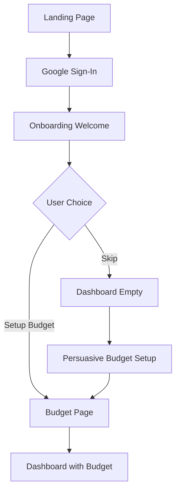

# 🎯 DuitTrack Complete User Flow Architecture

## 🚀 Application Flow Overview

DuitTrack menggunakan **dedicated page navigation** dengan smart return logic. Setiap page adalah destination terpisah dengan context preservation untuk seamless user experience.

---

## 🌊 Core User Journeys

### **1. First-Time User Journey**
```
Landing Page → Onboarding → Dashboard (Empty State) → Budget Setup → Full Experience
```

**Detailed Flow:**


### **2. Daily Usage Pattern (Power User)**
```
Dashboard → Quick Check → Add Expense → Return to Dashboard
```

### **3. Budget Management Flow**
```
Dashboard → Budget Page → Edit Categories → View Category Details → Expenses (Filtered)
```

### **4. Expense Analysis Flow**
```
Dashboard → Expenses Page → Filter/Search → View Details → Edit/Delete → Return
```

---

## 📱 Page-by-Page User Flows

### **Landing Page (`/`)**

**Purpose**: Authentication dan first impression
**User Goal**: Sign in dengan Google

```
User Flow:
1. User sees hero section dengan selling points
2. User reads features (Mobile-first, Smart budgeting, etc.)
3. User clicks "Masuk dengan Google"
4. Google Auth popup → Firebase authentication
5. Success → Navigate to Onboarding

Error Flows:
- Auth failed → Show error message, retry option
- Network error → Show offline message
```

**Exit Points:**
- ✅ Success → `/onboarding`
- ❌ Error → Stay di landing dengan error message

---

### **Onboarding Page (`/onboarding`)**

**Purpose**: Welcome user dan setup preference
**User Goal**: Choose initial setup approach

```
User Flow:
1. Display welcome dengan user's Google name
2. Show features preview (4 icons)
3. Present dual choice:
   - "Setup Budget Dulu" (recommended)
   - "Mulai Tracking Sekarang" (skip)
4. User selects option
5. Navigate based on choice

Decision Tree:
├── Setup Budget → `/budget?onboarding=true`
└── Skip → `/dashboard` (dengan empty state)
```

**Exit Points:**
- 📊 Budget Setup → `/budget?onboarding=true`
- 🏠 Dashboard → `/dashboard`

---

### **Dashboard (`/dashboard`)**

**Purpose**: Central hub untuk financial overview
**User Goal**: Quick overview dan access core features

```
Main User Actions:
1. Check budget status (always visible)
2. Review recent transactions (quick scan)
3. Add new expense (primary CTA)
4. Navigate to detailed pages

Navigation Options:
├── 💰 Add Expense → `/add-expense?return=dashboard`
├── 🕒 Expenses → `/expenses?return=dashboard`
├── 🎯 Budget → `/budget?return=dashboard`
├── 📊 Reports → `/reports?return=dashboard`
└── 🍔 Menu → Dropdown navigation
```

**State Variations:**
- **Empty State**: No budget setup → persuasive messaging
- **Warning State**: Categories over 80% → show warnings
- **Normal State**: Regular overview dengan all data

**Exit Points:**
- Primary actions lead to dedicated pages dengan return context
- Menu navigation to any app section

---

### **Add Expense (`/add-expense?return={source}`)**

**Purpose**: Quick expense entry dengan minimal friction
**User Goal**: Log expense rapidly dan return to workflow

```
User Flow:
1. Choose input method (Manual default, Invoice coming soon)
2. Fill required fields:
   - Amount (dengan thousand formatting)
   - Category (visual selection)
3. Optional fields:
   - Date (default today)
   - Notes (free text)
4. Save expense
5. Smart return to source page

Form Validation:
├── Real-time formatting (25000 → 25.000)
├── Required field validation
├── Category selection required
└── Save button enabled when valid

Smart Return Logic:
├── From Dashboard → Return to Dashboard
├── From Expenses → Return to Expenses (refreshed)
├── From Budget → Return to Budget
└── Direct access → Default to Dashboard
```

**Exit Points:**
- ✅ Save success → Return to source dengan fresh data
- ❌ Cancel → Return to source tanpa changes

---

### **Budget Management (`/budget?return={source}`)**

**Purpose**: Setup dan manage budget categories
**User Goal**: Set budgets, edit amounts, view category details

```
User Actions:
1. View current budget overview
2. Manage categories:
   - Add new category
   - Edit budget amounts (inline)
   - Delete categories
   - Sort categories (Modified/Alphabetical/Urgency)
3. View category details
4. Manage period settings

Category Detail Flow:
1. User clicks "Lihat Detail Transaksi" pada category
2. Navigate to `/expenses?category={name}&return=budget`
3. Expenses page auto-filtered by category
4. User can manage transactions
5. Return to budget page when done

Period Management:
├── Change period → Data refresh
├── Edit reset date → Apply to next period
└── View historical periods
```

**State Variations:**
- **Empty State**: No categories → "Tambah Kategori Pertama"
- **Onboarding Mode**: `?onboarding=true` → After setup → Dashboard
- **Normal Mode**: Regular management dengan data

**Exit Points:**
- 🔍 Category Details → `/expenses?category={name}&return=budget`
- ← Back → Return to source atau Dashboard

---

### **Expenses History (`/expenses?category={name}&return={source}`)**

**Purpose**: Complete transaction management dengan analytics
**User Goal**: Review, search, edit, analyze expenses

```
User Flow:
1. View summary dengan daily spending chart
2. Filter/search transactions:
   - Category chips (horizontal scroll)
   - Search by merchant name/notes
   - Date range (via period selector)
3. Review transaction list (grouped by date)
4. Expand transaction untuk details
5. Edit/delete individual transactions
6. Add new expense jika needed

Chart Interaction:
├── View daily spending patterns
├── Filter by category → Chart colors change
├── Hover for exact amounts
└── Quick insights (average, peaks, streaks)

Transaction Management:
├── Tap transaction → Expand details
├── Edit transaction → Form dengan current data
├── Delete transaction → Confirmation dialog
└── Add expense → `/add-expense?return=expenses`
```

**URL Parameters:**
- `?category=makanan` → Auto-filter by category
- `?return=budget` → Smart return destination
- No params → Show all transactions

**Exit Points:**
- 💰 Add Expense → `/add-expense?return=expenses`
- ← Back → Return to source atau Dashboard

---

## 🔄 Smart Navigation System

### **Return Logic Implementation**
```typescript
interface NavigationContext {
  source: 'dashboard' | 'budget' | 'expenses';
  filters?: {
    category?: string;
    period?: string;
  };
  scrollPosition?: number;
}

// Example URL patterns:
// /add-expense?return=dashboard
// /expenses?category=makanan&return=budget
// /budget?onboarding=true
```

### **Context Preservation**
- **Scroll positions** maintained on return
- **Filter states** preserved across navigation
- **Form data** cached untuk incomplete forms
- **Period selection** consistent across pages

---

## 🍔 Navigation Menu System

### **Hamburger Menu Structure**
```
Menu Items (Dropdown style):
├── 🏠 Dashboard → `/dashboard`
├── 💰 Riwayat Transaksi → `/expenses`
├── 📊 Laporan & Chart → `/reports` (future)
├── 🎯 Kelola Budget → `/budget`
├── 📤 Export Data → Export modal (future)
├── ⚙️ Settings → `/settings` (future)
└── 🚪 Logout → Confirmation + sign out
```

### **Menu Behavior**
- **Apple Music inspired** dropdown dari hamburger
- **Click outside** → Close menu
- **Item selection** → Navigate + close menu
- **Current page** → Highlighted in menu

---

## ⚡ Critical User Flows

### **Happy Path: Daily Expense Entry**
```
1. User opens app → Dashboard
2. Sees budget status (normal/warning)
3. Clicks "Tambah Pengeluaran"
4. Fills amount (auto-format) + category
5. Saves expense
6. Returns to Dashboard dengan updated data
7. Sees impact on budget immediately

Time: ~30 seconds
Taps: 3-4 total
```

### **Power User: Budget Management**
```
1. Dashboard → Notice category warning
2. Navigate to Budget page
3. Review category details
4. Click "Lihat Detail Transaksi"
5. Review filtered expenses
6. Edit incorrect transaction
7. Return to Budget → See updated status
8. Return to Dashboard

Time: ~2 minutes
Pages: Dashboard → Budget → Expenses → Budget → Dashboard
```

### **First-Time Setup**
```
1. Landing → Google Sign-in
2. Onboarding → Choose "Setup Budget"
3. Budget page → Add 3-4 categories
4. Set realistic amounts
5. Navigate to Dashboard
6. Add first expense
7. See system working

Time: ~3-4 minutes
Setup completed: Ready for daily use
```

---

## 🎯 UX Success Criteria

### **Speed Metrics**
- **Add Expense**: ≤30 seconds from dashboard
- **Budget Check**: Immediate on dashboard
- **Transaction Search**: ≤10 seconds to find

### **3-Tap Rule Compliance**
- **Add Expense**: Dashboard → Form → Save (2 taps)
- **Check Budget**: Dashboard → Budget (1 tap)
- **View Category**: Budget → Detail (1 tap)

### **Error Recovery**
- **Network errors**: Graceful offline message
- **Validation errors**: Clear feedback + correction path
- **Data conflicts**: Auto-resolve atau user choice

---

## 🔄 State Management Flow

### **Global State**
```typescript
interface AppState {
  user: UserProfile | null;
  currentPeriod: string;
  budgets: BudgetData;
  expenses: ExpenseData[];
  navigation: NavigationContext;
  ui: UIState;
}
```

### **Data Synchronization**
- **Real-time listeners** untuk budget dan expense updates
- **Optimistic updates** untuk immediate feedback
- **Conflict resolution** untuk concurrent edits
- **Offline support** untuk core functionality

---

## 🚀 Implementation Priority

### **Phase 1: Core Navigation**
1. Landing → Onboarding → Dashboard basic flow ✅
2. Add Expense form dengan return logic ❌
3. Budget page basic functionality ❌

### **Phase 2: Advanced Features**
4. Expenses page dengan filtering ❌
5. Chart integration dan analytics ❌
6. Smart navigation dengan context preservation ❌

### **Phase 3: Polish**
7. Offline support dan error handling ❌
8. Performance optimization ❌
9. Advanced features (reports, export, etc.) ❌

---

## 🛠️ Technical Implementation

### **Route Structure**
```
src/routes/
├── +page.svelte              # Landing page ✅
├── +layout.svelte             # Global layout ✅
├── onboarding/+page.svelte    # Onboarding ✅
├── dashboard/+page.svelte     # Dashboard ✅
├── add-expense/+page.svelte   # Add expense ❌
├── expenses/+page.svelte      # Expenses history ❌
├── budget/+page.svelte        # Budget management ❌
├── reports/+page.svelte       # Analytics (future) ❌
└── reset-account/+page.svelte # Account reset ✅
```

### **Component Architecture**
```
src/lib/components/
├── auth/                      # Authentication ✅
├── navigation/                # Navigation ✅
├── dashboard/                 # Dashboard widgets ✅
├── budget/                    # Budget components ✅
├── expense/                   # Expense components ✅
├── charts/                    # Chart components ❌
└── common/                    # Shared components ❌
```

### **Store Management**
```typescript
// Navigation Store (New)
interface NavigationStore {
  currentPage: string;
  returnPath: string | null;
  scrollPositions: Record<string, number>;
  filters: Record<string, any>;
}

// Enhanced Budget Store
interface BudgetStore {
  categories: BudgetCategory[];
  currentPeriod: string;
  periods: PeriodData[];
  loading: boolean;
}

// Enhanced Expense Store
interface ExpenseStore {
  expenses: Expense[];
  filteredExpenses: Expense[];
  currentFilters: ExpenseFilters;
  chartData: ChartData;
  loading: boolean;
}
```

---

**Tech Implementation**: Svelte stores untuk state management, SvelteKit routing untuk navigation, Firebase real-time listeners untuk data sync.

---

**Last Updated**: September 23, 2025 | **Status**: Documentation Complete - Ready for Implementation
**Implementation Priority**: Phase 1 - Core Navigation & Pages